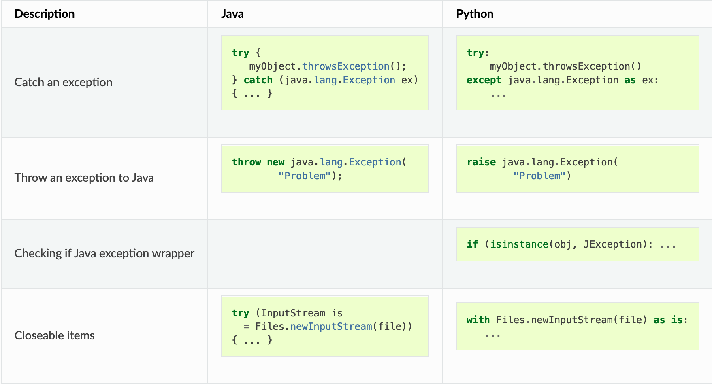

+++
title = "Write first, wrap elsewhere: the case of JPype"
description = "Multiplatform programming among Python and JVM via JPype"
outputs = ["Reveal"]
aliases = [
    "/wfbe/",
    "/python/",
    "/jpype/",
]
+++

## Write first, wrap elsewhere: the case of [JPype](https://jpype.readthedocs.io/)

- In the end of the day, the Python interpreter is C++ software

- Most commonly, efficient Python code is written in C++ and then wrapped into Python

- Put it simply, the JVM too is C++ software

- Can Python code be written in Java and then wrapped into Python?

- Apparently yes, via several ad-hoc bridging technologies:
    * [JPype](https://jpype.readthedocs.io/) a bridge for calling JVM code from Python as a native library
    * [Jython](https://jython.org/) a JVM-based Python interpreter
    * [Py4J](https://www.py4j.org/) an RPC based bridge for calling Java from Python
    * [Pyjnius](https://pyjnius.readthedocs.io/) similar to JPype, but based on [Cython](https://cython.org)
    * and many others...

- Why exactly JPype?
    * still maintained, works with vanilla CPython, good documentation, good interoperabilty with JVM types

---

## JPype Overview:

1. Ensure you have a JVM installed on your system
    + with the `JAVA_HOME` environment variable set to the JVM installation directory

2. Ensure your compiled Java code is available as a `.jar` file
    + say, in `/path/to/my.jar`

2. Install the JPype package via `pip install JPype1`

3. You first need JPype to start a JVM instance in your Python process
    + tby default, JVM location is inferred from the `JAVA_HOME` environment variable

    ```python
    import jpype

    # start the JVM
    jpype.startJVM(classpath=["/path/to/my.jar"])
    ```

4. Once the JVM is started, one can import Java classes and call their methods as if they were Python objects

    ```python
    import jpype.imports # this is necessary to import Java classes

    from java.lang import System # import the java.lang.System class

    System.out.println("Hello World!")
    ```

---

## JPype's Bridging Model (pt. 1)

Overview on the [official documentation](https://jpype.readthedocs.io/en/latest/quickguide.html#classes-objects)

- Java __classes__ are __presented__ wherever possible _similar_ to Python classes

- the only major difference is that __Java classes__ and objects are _closed_ and __cannot be modified__



---

## JPype's Bridging Model (pt. 2)

Overview on the [official documentation](https://jpype.readthedocs.io/en/latest/quickguide.html#exceptions)

- Java exceptions extend from Python exceptions

- Java exceptions can be dealt with in the same way as Python native exceptions
    * i.e. via `try`-`except` blocks

- `JException` serves as the base class for all Java exceptions

<!--  -->



---

## JPype's Bridging Model (pt. 3)

Overview on the [official documentation](https://jpype.readthedocs.io/en/latest/quickguide.html#primitives)

- most Python primitives __directly map__ into Java primitives

- however, Python does _not_ have the _same_ primitive types...

- ... hence, __explicit casts__ may be needed in some cases

- each primitive Java type is __exposed__ in JPype (`jpype.JBoolean`, `.JByte`, `.JChar`, `.JShort`, `.JInt`, `.JLong`, `.JFloat`, `.JDouble`).



---

## JPype's Bridging Model (pt. 4)

Overview on the [official documentation](https://jpype.readthedocs.io/en/latest/quickguide.html#strings)

- Java strings are __similar__ to Python strings

- they are both __immutable__ and produce a new string when altered

- most operations can use Java strings __in place__ of Python strings
    + with minor exceptions, as Python strings are not completely _duck typed_

- when comparing or using strings as dictionary keys, all `JString` objects should be converted to Python



---

## JPype's Bridging Model (pt. 5)

Overview on the [official documentation](https://jpype.readthedocs.io/en/latest/quickguide.html#arrays)

- Java arrays are __mapped__ to Python __lists__ 

- more precisely, they __operate like__ Python _lists_, but they are __fixed in size__

- reading a __slice__ from a Java array returns a _view_ of the array, __not a copy__

- passing a __slide__ of a Python list to Java will create a __copy__ of the sub-list




---

## JPype's Bridging Model (pt. 6)

Overview on the [official documentation](https://jpype.readthedocs.io/en/latest/quickguide.html#collections)

- Java collections are __overloaded__ with Python __syntax__ where possible 
    + to operate similarly to Python collections

- Java's `Iterable`s are __mapped__ to Python _iterables_ by overriding the `__iter__` method

- Java's `Collection`s are __mapped__ to Python containers by overriding `__len__`

- Java's `Map`s support Python's __dictionaries__ syntax by overriding `__getitem__` and `__setitem__`

- Java's `List`s support Python's __lists__ syntax by overriding `__getitem__` and `__setitem__`



---

## JPype's Bridging Model (pt. 7)

Overview on the [official documentation](https://jpype.readthedocs.io/en/latest/quickguide.html#mplements-and-extension)

- Java _interfaces_ can be __implemented__ in Python, via JPype's __decorators__

- Java's open / abstract classes __cannot be extended__ in Python

- Python __lambda expressions__ can be cast'd to Java's __functional interfaces__



---

## JPype type conversion model (pt. 1)

Overview on the [official documentation](https://jpype.readthedocs.io/en/latest/userguide.html#type-matching)



---

## JPype type conversion model (pt. 2)

### Legend

- none, there is no way to convert

- __explicit__ (_E_), JPype can convert the desired type, but only explicitly via casting

- __implicit__ (_I_), JPype will convert as needed

- __exact__ (_X_), like implicit, but takes _priority_ in __overload selection__

---

## Overload selection

- Consider the following example of Python code with JPype:
    ```python
    import jpype.imports
    from java.lang import System

    System.out.println(1)
    System.out.println(2.0)
    System.out.println('A')
    ```

- Which overload of `System.out.println` is called among the [many admissible ones](https://docs.oracle.com/en/java/javase/17/docs/api/java.base/java/io/PrintStream.html)?
    * Python's `1` is convertible to Java's `int`, `long`, and `short` 
        + but Java's `int` is the __exact__ match
    * Python's `2.0` is convertible to Java's `float` and `double`
        + but Java's `double` is the __exact__ match
    * Python's `'A'` is convertible to Java's `String` and `char` 
        + but Java's `String` is the __exact__ match

---

## Ambiguous overload selection

- Consider the following example of Python code with JPype:
    ```python
    import jpype

    csv = jpype.JPackage("io.github.gciatto.csv.Csv")

    csv.headerOf(["filed", "another field"])
    ```

- This would raise the following __error__:
    ```
    TypeError: Ambiguous overloads found for io.github.gciatto.csv.Csv.headerOf(list) between:
        public static final io.github.gciatto.csv.Header io.github.gciatto.csv.Csv.headerOf(java.lang.Iterable)
        public static final io.github.gciatto.csv.Header io.github.gciatto.csv.Csv.headerOf(java.lang.String[])
    ```

    * because Python's `list` is convertible to both Java's `Iterable` and `String[]`
        + but neither is the __exact__ match

- To solve this issue, one can __explicitly__ cast the Python `list` to the desired Java type:

    ```python
    import jpype
    import jpype.imports
    from java.lang import Iterable as JIterable

    csv = jpype.JClass("io.github.gciatto.csv.Csv")

    csv.headerOf(JIterable@["field", "another field"])
    # returns Header("field", "another field")
    ```

---

## Customising Java types in Python (pt. 1)

- One may customise the behaviour of Java types in Python by __providing custom implementations__ for them
    + by means of the `@JImplementationFor` decorator

- In that case the special method `__jclass_init__` is called on the custom implementation, _just once_, to configure the class

- In _type hierarchies_, implementations provided for superclasses are __inherited__ by subclasses

---

## Customising Java types in Python (pt. 2)

Consider for instance the following customisations, allowing to use _Java collections_ with __Python syntax__

```python
from typing import Iterable, Sequence


@jpype.JImplementationFor("java.lang.Iterable")
class _JIterable:
    def __jclass_init__(self):
        Iterable.register(self) # makes this class a subtype of Iterable, to speed up isinstance checks 

    def __iter__(self):
        return self.iterator()


@jpype.JImplementationFor("java.util.Collection")
class _JCollection:
    def __len__(self):
        return self.size()      # supports "len(coll)" syntax

    def __delitem__(self, i):
        return self.remove(i)   # supports "del coll[i]" syntax

    def __contains__(self, i):
        return self.contains(i) # supports "i in coll" syntax

    # __iter__ is inherited from _JIterable
    # because in Java: Collection extends Iterable


@jpype.JImplementationFor('java.util.List')
class _JList(object):
    def __jclass_init__(self):
        Sequence.register(self) # makes this class a subtype of Sequence, to speed up isinstance checks

    def __getitem__(self, ndx):
        return self.get(ndx)   # supports "list[i]" syntax

    def append(self, obj):
        return self.add(obj)   # supports "list.append(obj)" syntax

    # __len__, __delitem__, __contains__, __iter__ are inherited from _JCollection
```

this is taken directly from [JPype's codebase](https://github.com/jpype-project/jpype/blob/7363ce8a357d0b64f537c31849bd4e43732d9cdf/jpype/_jcollection.py)

---

## Making wrapped code Pythonic (pt. 1)

- The code wrapped via JPype is __not__ Pythonic by default
    + it works in principle, but it is very _hard to use_ for the average Python developer
        * we cannot assume the _average_ Python developer is _familiar_ with _Java_...
        * nor with JPype
        * and the developer should know both aspects to use the wrapped code _as is_

- It is important to make the wrapped code as _Pythonic_ as possible
    + __factory methods__ for building instances of types
    + simplified __package structure__
        * e.g. `io.github.gciatto.csv.Csv` $\rightarrow$ `jcsv.Csv`
    + __properties__ instead of _getters_ and _setters_
    + `snake_case` instead of `camelCase`
    + __magic methods__ implemented whenever possible
        * e.g. `__len__` for `java.util.Collection`
        * e.g. `__getitem__` for `java.util.List`
    + __optional parameters__ in methods instead of _overloads_

- All such refinements can be done in JPype via __customisations__ of the Java types
    + _unit tests_ should be written to ensure the customisations are _not broken_ by future changes

---

## Making wrapped code Pythonic (pt. 2)

### Workflow

For all __public types__ in the wrapped _Java library_:
- decide their corresponding __Python package__
- provide Pythonic __factory methods__
- __customise__ the Python class to make it _Pythonic_ (possibly exploiting __type hierarchies__ to save time)
    + add __properties__ calling _getters/setters_
    + __override__ Java methods to make them _Pythonic_
        * e.g. use _magic methods_ where possible
        * e.g. use _optional parameters_ where possible, removing the need for _overloads_
- write __unit tests__ for _Pythonic API_

---

## Example: the `jcsv` package (pt. 1)

- The `jcsv` package is a Pythonic wrapper for our JVM-based `io.github.gciatto.csv` library

- Java's type definition are brought to Python in `jcsv/__init__.py`:

    ```python
    import jpype
    import jpype.imports
    from java.lang import Iterable as JIterable

    _csv = jpype.JPackage("io.github.gciatto.csv")

    Table = _csv.Table
    Row = _csv.Row
    Record = _csv.Record
    Header = _csv.Header
    Formatter = _csv.Formatter
    Parser = _csv.Parser
    Configuration = _csv.Configuration
    Csv = _csv.Csv
    CsvJvm = _csv.CsvJvm
    ```

    making it possible to write the following code on the user side:
    
    ```python
    from jcsv import Table, Record, Header
    ```
---

## Example: the `jcsv` package (pt. 2)

- __Parsing__ and **formatting** operations are mapped _straightforwardly_ to Python functions:

    ```python
    # jcsv/__init__.py

    def parse_csv_string(string, separator = Csv.DEFAULT_SEPARATOR, delimiter = Csv.DEFAULT_DELIMITER, comment = Csv.DEFAULT_COMMENT):
        return Csv.parseAsCSV(string, separator, delimiter, comment)


    def parse_csv_file(path, separator = Csv.DEFAULT_SEPARATOR, delimiter = Csv.DEFAULT_DELIMITER, comment = Csv.DEFAULT_COMMENT):
        return CsvJvm.parseCsvFile(str(path), separator, delimiter, comment)


    def format_as_csv(rows, separator = Csv.DEFAULT_SEPARATOR, delimiter = Csv.DEFAULT_DELIMITER, comment = Csv.DEFAULT_COMMENT):
        return Csv.formatAsCSV(JIterable@rows, separator, delimiter, comment)
    ```

---

## Example: the `jcsv` package (pt. 3)

- Ad-hoc _factory method_ is provided for building `Header` instances:
    
    ```python
    # jcsv/__init__.py
    from jcsv.python import iterable_or_varargs

    def header(*args):
        if len(args) == 1 and isinstance(args[0], int):
            return Csv.anonymousHeader(args[0])
        return iterable_or_varargs(args, lambda xs: Csv.headerOf(JIterable@map(str, xs)))
    ```

    making it possible to write the following code on the user side:
    
    ```python
    import jcsv

    header1 = jcsv.header("column1", "column2", "column3") 
    header2 = jcsv.header(3) # anonymous header with 3 columns
    columns = (f"column{i}" for i in range(1, 4)) # generator expression
    header3 = jcsv.header(columns) # same as header1, but passing an interable
    ```

- Function `iterable_or_varargs` aims at _simulating_ **multiple overloads**:
    
    ```python
    # jcsv/python.py
    from typing import Iterable

    def iterable_or_varargs(args, f):
        assert isinstance(args, Iterable)
        if len(args) == 1:
            item = args[0]
            if isinstance(item, Iterable):
                return f(item)
            else:
                return f([item])
        else:
            return f(args)
    ```

---

## Example: the `jcsv` package (pt. 4)

- Ad-hoc _factory method_ is provided for building `Record` instances:

    ```python
    # jcsv/__init__.py

    def record(header, *args):
        return iterable_or_varargs(args, lambda xs: Csv.recordOf(header, JIterable@map(str, xs)))
    ```

- Ad-hoc _factory method_ is provided for building `Table` instances:

    ```python
    # jcsv/__init__.py

    def __ensure_header(h):
        return h if isinstance(h, Header) else header(h)
    def __ensure_record(r, h):
        return r if isinstance(r, Record) else record(h, r)

    def table(header, *args):
        header = __ensure_header(header)
        args = [__ensure_record(row, header) for row in args]
        return iterable_or_varargs(args, lambda xs: Csv.tableOf(header, JIterable@xs))
    ```

---

## Example: the `jcsv` package (pt. 5)

- The `Row` class is customised to make it more Pythonic:
    ```python
    # jcsv/__init__.py

    @jpype.JImplementationFor("io.github.gciatto.csv.Row")
    class _Row:
        def __len__(self):
            return self.getSize()

        def __getitem__(self, item):
            if isinstance(item, int) and item < 0:
                item = len(self) + item
            try:
                return self.get(item)
            except _java.IndexOutOfBoundsException as e:
                raise IndexError(f"index {item} out of range") from e

        @property
        def size(self):
            return len(self)
    ```

    + supporting the syntax `len(row)` instead of `row.getSize()`
    + supporting the syntax `row[i]` instead of `row.get(i)`
    + supporting the syntax `row[-i]` instead of `row.get(row.getSize() - i - 1)`
    + letting `IndexError` be raised instead of `IndexOutOfBoundsException`
    + supporting the syntax `row.size` instead of `row.getSize()`

---

## Example: the `jcsv` package (pt. 6)

- The `Header` shall inherit all customisation for `Row`, plus the following ones:
    ```python
    @jpype.JImplementationFor("io.github.gciatto.csv.Header")
    class _Header:
        @property
        def columns(self):
            return [str(c) for c in self.getColumns()]

        def __contains__(self, item):
            return self.contains(item)

        def index_of(self, column):
            return self.indexOf(column)
    ```

    + supporting the syntax `header.columns` instead of `header.getColumns()`
    + supporting the syntax `column in header` instead of `header.contains(column)`
    + supporting the syntax `header.index_of(column)` instead of `header.indexOf(column)`

---

## Example: the `jcsv` package (pt. 7)

- The `Record` shall inherit all customisation for `Row`, plus the following ones:
    ```python
    @jpype.JImplementationFor("io.github.gciatto.csv.Record")
    class _Record:
        @property
        def header(self):
            return self.getHeader()

        @property
        def values(self):
            return [str(v) for v in self.getValues()]

        def __contains__(self, item):
            return self.contains(item)
    ```

    + supporting the syntax `record.header` instead of `record.getHeader()`
    + supporting the syntax `record.values` instead of `record.getValues()`
    + supporting the syntax `value in record` instead of `record.contains(value)`

---

## Example: the `jcsv` package (pt. 8)

- The `Table` class is customised too, to make it more Pythonic:
    ```python
    @jpype.JImplementationFor("io.github.gciatto.csv.Table")
    class _Table:
        @property
        def header(self):
            return self.getHeader()

        def __len__(self):
            return self.getSize()

        def __getitem__(self, item):
            if isinstance(item, int) and item < 0:
                item = len(self) + item
            try:
                return self.get(item)
            except _java.IndexOutOfBoundsException as e:
                raise IndexError(f"index {item} out of range") from e

        @property
        def records(self):
            return self.getRecords()

        @property
        def size(self):
            return len(self)
    ```

    + supporting the syntax `table.header` instead of `table.getHeader()`
    + supporting the syntax `len(table)` instead of `table.getSize()`
    + supporting the syntax `table[i]` instead of `table.get(i)`
    + supporting the syntax `table[-i]` instead of `table.get(table.getSize() - i - 1)`
    + supporting the syntax `record in table` instead of `table.contains(record)`
    + supporting the syntax `table.records` instead of `table.getRecords()`

---

## Including `.jar`s in JPype projects (pt. 1)

```bash
csv-python/
├── build.gradle.kts            # this is where the generation of csv.jar is automated
├── jcsv
│   ├── __init__.py
│   ├── jvm
│   │   ├── __init__.py         # this is where JPype is loaded
│   │   └── csv.jar             # this the Fat-JAR of the JVM-based library
│   └── python.py
├── requirements.txt
└── test
    ├── __init__.py
    ├── test_parsing.py
    └── test_python_api.py
```

1. The `build.gradle.kts` file automated the generation of the `csv.jar` file
    + it is a _Fat-JAR_ containing all the dependencies of the JVM-based library
    + such JAR is placed in the `jcsv/jvm` directory
    + it is part of Python sources, so that it can be distributed with the Python library

2. The `jcsv/jvm/__init__.py` file loads JPype and the `csv.jar` file

---

## Including `.jar`s in JPype projects (pt. 2)

1. Snippet from the `build.gradle.kts`:

    ```kotlin
    tasks.create<Copy>("createCoreJar") {
        group = "Python"
        val shadowJar by project(":csv-core").tasks.getting(Jar::class)
        dependsOn(shadowJar)
        from(shadowJar.archiveFile) {
            rename(".*?\\.jar", "csv.jar")
        }
        into(projectDir.resolve("jcsv/jvm"))
    }
    ```

2. Content of the `jcsv/jvm/__init__.py` file:

    ```python
    import jpype
    from pathlib import Path

    # the directory where csv.jar is placed
    CLASSPATH = Path(__file__).parent

    # the list of all .jar files in CLASSPATH
    JARS = [str(j.resolve()) for j in CLASSPATH.glob('*.jar')]

    jpype.startJVM(classpath=JARS)
    ```

3. Important line in `jcsv/__init__.py`:
    ```python
    import jcsv.jvm
    ```

    this is forcing the startup of the JVM with the correct classpath whenever someone is using the `jcsv` module

---

{}
